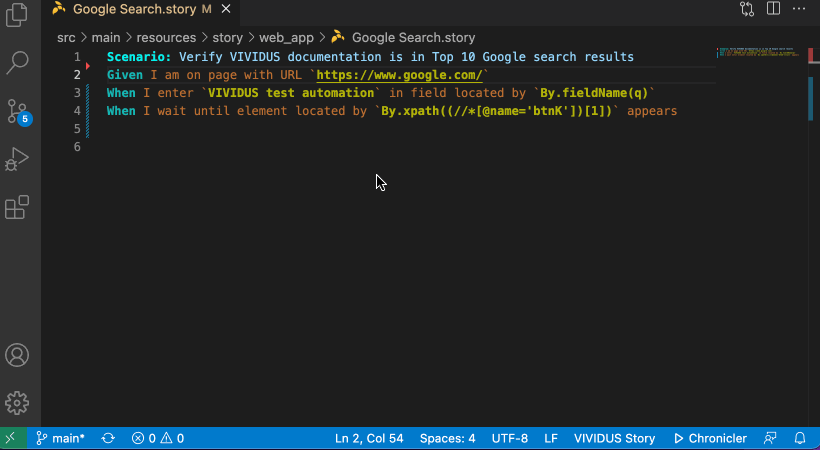

VIVIDUS extension for Visual Studio Code
==========================

[](https://marketplace.visualstudio.com/items?itemName=vividus.vividus-studio)
[](https://marketplace.visualstudio.com/items?itemName=vividus.vividus-studio)
[](https://marketplace.visualstudio.com/items?itemName=vividus.vividus-studio)

[](https://open-vsx.org/extension/vividus/vividus-studio)
[](https://open-vsx.org/extension/vividus/vividus-studio)
[](https://open-vsx.org/extension/vividus/vividus-studio)

[](https://github.com/vividus-framework/vividus-studio/actions/workflows/build.yml)
[](https://codecov.io/gh/vividus-framework/vividus-studio)
[](https://github.com/vividus-framework/vividus-studio/blob/main/LICENSE)

Quick Start
============

1. Download and install JDK 21.
2. Install the [VIVIDUS Studio Extension](https://marketplace.visualstudio.com/items?itemName=vividus.vividus-studio).
3. The extension is activated when you open a project containing story or steps files.

VS Code Settings
==========================

* `vividus-studio.java-home`: The directory path containing JDK to run the extension, if not specified the JDK is located automatically.
* `vividus-studio.stories-runner`: Stories runner class (the fully qualified name).

Source Code Actions
==========================

### Action 'Insert Step'



Configure Shortcuts
==========================

The keyboard shortcut for `Source Action...` can be configured using the following menu paths:

*macOS*
```
Code -> Settings... -> Keyboard Shortcuts -> Source Action...
```
*Windows*
```
File -> Preferences -> Keyboard Shortcuts -> Source Action...
```

